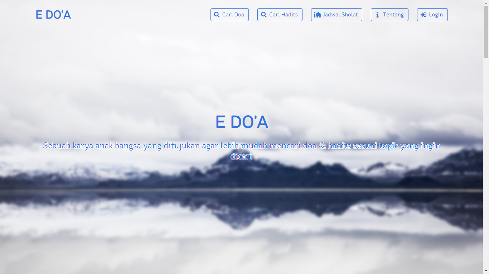
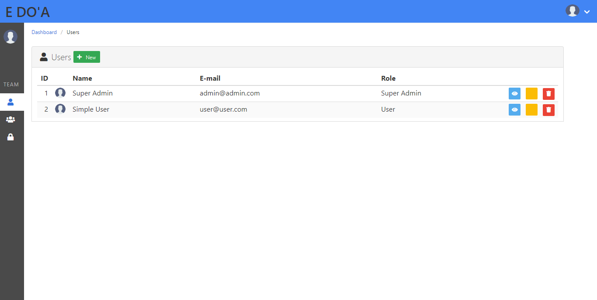

# E-DOA

E-Doa merupakan project inisiatif anak muda guna memudahkan akses masyarakat terhadap hadits, do'a & jadwal sholat melalui teknologi modern yang dekat dengan keseharian mobilitas generasi produktif yang dinamis

## Table of Contents
- [Tentang repository](#tentang-repository-ini)
- [Tech](#tech)
- [Screenshots](#screenshots)
- [Cara Menginstall](#cara-menginstall)
- [Dokumentasi](#dokumentasi)

## Tentang Repository Ini
[E-Doa] project master repository

## Tech
Di bagian Frontend, [E-Doa] menggunakan beberapa project open-source untuk dapat bekerja maksimal:
  - [bulma] - Framework CSS untuk _User Interface_
  - [fontawesome] - SVG icon untuk _User Experience_ yang lebih baik
  - [animate.css] - Animasi CSS untuk _User Interface_ yang lebih interaktif
  - [jquery] - Javascript library
  - [ST Ryde] - Font di page home by [Stereotypes]

Di bagian Backend, [E-Doa] menggunakan: 
  - [laravel] - PHP framework
  - [siswadi.praytime] - HTTP JSON API Waktu sholat by [Siswadi]

[E-Doa] juga menggunakan [nodejs] (npm) untuk menginstall beberapa _package_ diatas

[bulma]: <https://bulma.io/>
[bulma-extensions]: <https://wikiki.github.io/>
[fontawesome]: <https://fontawesome.com/>
[animate.css]: <https://daneden.github.io/animate.css/>
[jquery]: <http://jquery.com>
[nodejs]: <https://nodejs.org/>
[laravel]: <https://laravel.com/>
[E-Doa]: <https://github.com/arifinizz/e-doa.git>
[ST Ryde]: <https://www.fonts.com/font/stereotypes/st-ryde>
[Stereotypes]: <https://www.fonts.com/font/stereotypes>
[siswadi.praytime]: <https://gist.github.com/siswadi/b24f13ddc80eb92e0b01a8a595c32433>
[Siswadi]: <https://gist.github.com/siswadi/>

## Screenshots



## Cara Menginstall
1. Pastikan pc sudah terinstall [Composer](https://getcomposer.org/), [Git](https://git-scm.com/), [Node](https://nodejs.org/en/) dan [NPM](https://www.npmjs.com/).
1. Download atau clone repository ini, lalu buka terminal/cmd:
   ```
   git clone https://github.com/arifinizz/edoa.git edoa
   cd edoa
   ```
1. `composer install` : install via composer
1. `yarn && yarn run dev` (or `npm install && npm run dev`) : install dependencies dan compile assets.
1. Buat database kosong dengan nama `edoa`
1. Modifikasi `.env` file dan sesuaikan sql server, username & password
1. `php artisan key:generate` : Membuat kunci aplikasi dan link folder penyimpanan
1. `php artisan migrate --seed` : Memindahkan database dari database laravel ke mysql
1. `php artisan serve` : Menjalankan di server lokal.
1. Login:
   - Administrator_ user: email *admin@admin.com* - password *123456*
   - Simple user_ user: email *user@user.com* - password *123456*
   
## Dokumentasi
  - [Laravel documentation](https://laravel.com/docs)
  - [Bulma documentation](http://bulma.io/documentation/overview/start)
